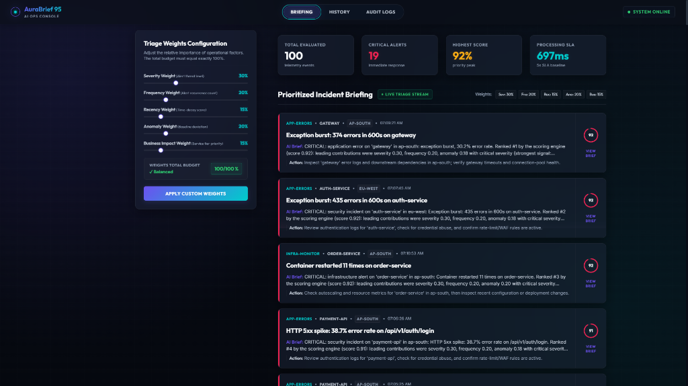
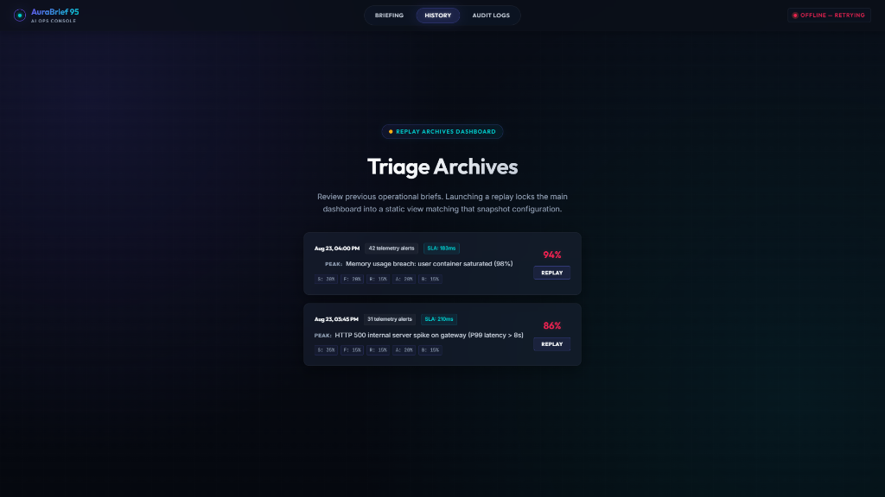
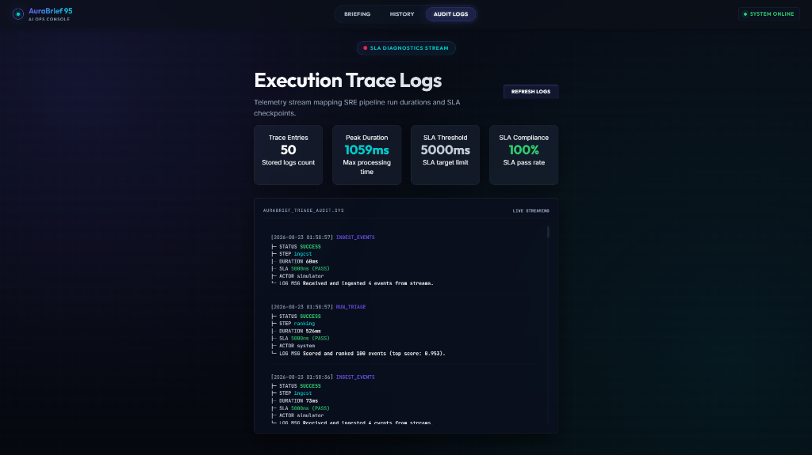

# AuraBrief 95

**AI-Powered Ops Briefing System for Incident Triage & Ranking**

AuraBrief 95 ingests simulated event streams from infrastructure, applications, and deployment pipelines, applies intelligent weighted scoring to rank incidents by priority, generates natural-language explanations using LLM, and surfaces results through a responsive operator console.

### Key Features
- 📱 **Mobile-Ready Responsive UI**: The frontend is built mobile-first and fully responsive. The dashboard layout, navigation, and event cards automatically adapt to fit phone and tablet screens perfectly.
- 🧠 **Intelligent Triage & Ranking**: Deterministic 5-signal scoring system that bubbles up critical incidents automatically.
- 🤖 **Gen-AI Explanations**: Automated incident briefings powered by a local Ollama LLM (llama3) with template fallback.
- ⏪ **Historical Replay**: View and interact with past triage snapshots directly in the dashboard.

### Dashboard & Briefing


### Execution Trace Logs


### Historical Archives (Replay Mode)

---

## Table of Contents

- [Quick Start](#quick-start)
- [Architecture Overview](#architecture-overview)
- [Services](#services)
- [Configuration](#configuration)
- [API Documentation](#api-documentation)
- [Project Structure](#project-structure)
- [Team & Skill Ownership](#team--skill-ownership)
- [Development Workflow](#development-workflow)
- [Troubleshooting](#troubleshooting)

---

## Quick Start

### Prerequisites

| Tool | Version | Purpose |
|------|---------|---------|
| [Docker](https://docs.docker.com/get-docker/) | 20.10+ | Container runtime |
| [Docker Compose](https://docs.docker.com/compose/install/) | 2.0+ | Multi-service orchestration |
| Git | 2.30+ | Version control |

### 1. Clone the Repository

```bash
git clone https://github.com/PesHwA07/Ascend-Round2-Team9.git
cd Ascend-Round2-Team9
```

### 2. Configure Environment

```bash
cp .env.example .env
```

Edit `.env` to set your Ollama host (see [Configuration](#configuration)).

### 3. Launch All Services

```bash
docker-compose up --build
```

### 4. Access the Application

| Service | URL | Description |
|---------|-----|-------------|
| **Frontend** | [http://localhost:5173](http://localhost:5173) | Operator dashboard (mobile + desktop) |
| **Backend API** | [http://localhost:8000](http://localhost:8000) | REST API |
| **API Docs** | [http://localhost:8000/docs](http://localhost:8000/docs) | Interactive Swagger UI |
| **Health Check** | [http://localhost:8000/api/health](http://localhost:8000/api/health) | Service status |

### 5. Stop Services

```bash
docker-compose down
```

---

## Architecture Overview

```
┌──────────────────────────────────────────────────────────────┐
│                      Docker Compose                          │
│                                                              │
│  ┌─────────────┐     ┌───────────────────────────────────┐   │
│  │  Simulator   │────▶│          FastAPI Backend           │   │
│  │  (3 streams) │     │                                   │   │
│  │              │     │  Ingest → Score/Rank → Explain    │   │
│  │ • infra      │     │                                   │   │
│  │ • app-errors │     │  ┌──────────┐  ┌──────────────┐  │   │
│  │ • deploys    │     │  │ Ranking  │  │ LLM Explainer│  │   │
│  └─────────────┘     │  │ Engine   │  │ (Ollama)     │  │   │
│                       │  └──────────┘  └──────────────┘  │   │
│                       │        │                          │   │
│                       │   ┌────▼─────┐                    │   │
│                       │   │  SQLite  │                    │   │
│                       │   └──────────┘                    │   │
│                       └───────────────────────────────────┘   │
│                                 ▲                             │
│  ┌──────────────────────────────┴──────────────────────────┐  │
│  │              React Frontend (Vite)                      │  │
│  │   • Dashboard (ranked incidents)                        │  │
│  │   • Event detail + AI explanation                       │  │
│  │   • Feedback panel (weight adjustment)                  │  │
│  │   • Triage history / replay                             │  │
│  │   • Audit log viewer                                    │  │
│  └─────────────────────────────────────────────────────────┘  │
└──────────────────────────────────────────────────────────────┘
```

---

## Services

### Backend (FastAPI)
- **Port:** 8000
- **Role:** REST API, event ingestion, weighted scoring, LLM explanation generation, audit logging
- **Database:** SQLite (persisted in `./data/`)
- **Key endpoints:** See [API Documentation](#api-documentation)

### Frontend (React + Vite)
- **Port:** 5173
- **Role:** Responsive operator dashboard, mobile-first glassmorphic UI
- **Proxy:** `/api/*` requests are proxied to backend (no CORS issues)

### Simulator
- **Port:** None (internal service)
- **Role:** Generates and sends simulated events to backend every 5 seconds
- **Streams:** Infrastructure monitoring, application errors, deployment pipeline
- **Features:** Correlated incident scenarios (e.g., deploy failure → error spike → CPU spike)

---

## Configuration

All configuration is via environment variables in `.env`:

| Variable | Default | Description |
|----------|---------|-------------|
| `OLLAMA_HOST` | `http://host.docker.internal:11434` | Ollama server URL (teammate's laptop IP) |
| `OLLAMA_MODEL` | `llama3` | LLM model name for generating explanations |
| `STREAM_INTERVAL` | `20` | Seconds between simulator event batches |
| `DATABASE_URL` | `sqlite:///./data/aurabrief.db` | SQLite database path |

### Ollama Setup

The Gen-AI explanations require an Ollama instance. Set `OLLAMA_HOST` to the network address of the machine running Ollama:

```bash
# If Ollama runs on a teammate's laptop at 192.168.1.42:
OLLAMA_HOST=http://192.168.1.42:11434

# If Ollama runs on the same machine (outside Docker):
OLLAMA_HOST=http://host.docker.internal:11434
```

**Fallback:** If Ollama is unavailable, the system automatically falls back to template-based explanations. The demo still functions fully.

---

## API Documentation

| Method | Endpoint | Description |
|--------|----------|-------------|
| `POST` | `/api/events/ingest` | Receive event batch from any stream |
| `GET` | `/api/triage/current` | Current ranked events with explanations |
| `GET` | `/api/triage/history` | Past triage snapshots for replay |
| `GET` | `/api/triage/history/{id}` | Full details of a past triage |
| `POST` | `/api/feedback` | Adjust ranking weights (returns re-ranked results) |
| `GET` | `/api/weights` | Current ranking weight configuration |
| `GET` | `/api/audit-log` | Processing step logs |
| `GET` | `/api/health` | Service health check |

Full request/response schemas: see [`API_SCHEMA.md`](API_SCHEMA.md).

---

## Project Structure

```
AuraBrief-95/
├── backend/                    # FastAPI backend service
│   ├── app/
│   │   ├── main.py             # App entry point, CORS, lifespan
│   │   ├── models.py           # SQLAlchemy database models
│   │   ├── database.py         # SQLite connection management
│   │   ├── schemas.py          # Pydantic request/response schemas
│   │   ├── config.py           # Settings and environment variables
│   │   ├── routers/            # API route handlers
│   │   │   ├── ingest.py       # Event ingestion endpoint
│   │   │   ├── triage.py       # Triage current + history endpoints
│   │   │   ├── feedback.py     # Weight adjustment endpoint
│   │   │   └── audit.py        # Audit log endpoint
│   │   └── services/           # Business logic
│   │       ├── ranking.py      # Weighted scoring engine
│   │       ├── explainer.py    # LLM explanation generator
│   │       └── audit_logger.py # Structured audit logging
│   ├── tests/                  # Backend unit tests
│   ├── Dockerfile
│   └── requirements.txt
├── frontend/                   # React + Vite frontend
│   ├── src/
│   │   ├── App.jsx             # Main layout manager
│   │   ├── index.css           # Design system (glassmorphic theme)
│   │   ├── components/         # UI components
│   │   ├── hooks/useApi.js     # API fetch hooks
│   │   └── utils/formatters.js # Date/score formatting
│   ├── Dockerfile
│   └── package.json
├── simulator/                  # Event stream simulator
│   ├── generate_events.py      # Event generation (3 streams)
│   ├── run.py                  # Event loop + API sender
│   ├── Dockerfile
│   └── requirements.txt
├── data/                       # SQLite database (persisted)
├── docker-compose.yml          # Multi-service orchestration
├── .env.example                # Environment template
├── API_SCHEMA.md               # Full API contract specification
├── ARCHITECTURE.md             # Skill ownership & design notes
├── DEMO_SCRIPT.md              # Demo walkthrough script
└── README.md                   # This file
```

---

## Team & Skill Ownership

See [`ARCHITECTURE.md`](ARCHITECTURE.md) for full details.

| Member | Skill | Primary Ownership |
|--------|-------|-------------------|
| M1 | AI/ML | Ranking engine, scoring formula, feedback loop logic |
| M2 | Gen-AI | LLM integration, prompt engineering, explanations |
| M3 | Cloud | Docker Compose, Dockerfiles, simulator, deployment |
| M4 | Mobile | React frontend, responsive UI, all visual components |
| M5 | Full-stack | API routes, database models, schemas, integration |

---

## Development Workflow

### Branch Strategy
Each member works on a dedicated feature branch:
```
main                          ← stable, merged work only
├── feature/cloud-infra-simulator    ← M3 (Cloud)
├── feature/backend-api              ← M5 (Full-stack)
├── feature/ranking-engine           ← M1 (AI/ML)
├── feature/llm-explanations         ← M2 (Gen-AI)
└── feature/frontend-dashboard       ← M4 (Mobile)
```

### Commit Guidelines
- Commit frequently in small logical chunks
- Use descriptive messages: `feat:`, `fix:`, `docs:`, `infra:`
- Never commit directly to `main` — use pull requests

### Running Without Docker
If Docker is unavailable:
```bash
# Terminal 1 — Backend
cd backend
pip install -r requirements.txt
uvicorn app.main:app --reload --port 8000

# Terminal 2 — Frontend
cd frontend
npm install
npm run dev

# Terminal 3 — Simulator
cd simulator
pip install -r requirements.txt
python run.py
```

---

## Troubleshooting

| Problem | Solution |
|---------|----------|
| `404 Not Found` on `/api/events/ingest` | M5's backend routes not deployed yet — expected during early development |
| Frontend shows blank page | Run `npm install` in `frontend/` or rebuild with `docker-compose up --build` |
| Simulator can't reach backend | Check Docker network — both must be in same compose stack |
| Ollama connection refused | Verify `OLLAMA_HOST` IP is correct and Ollama is running on teammate's machine |
| SQLite locked errors | Restart backend — WAL mode handles most concurrency, but heavy load may conflict |
| Port already in use | Stop other services on 8000/5173, or change ports in `docker-compose.yml` |
